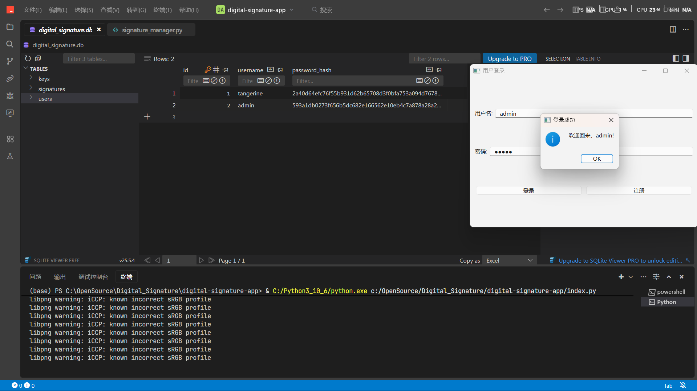
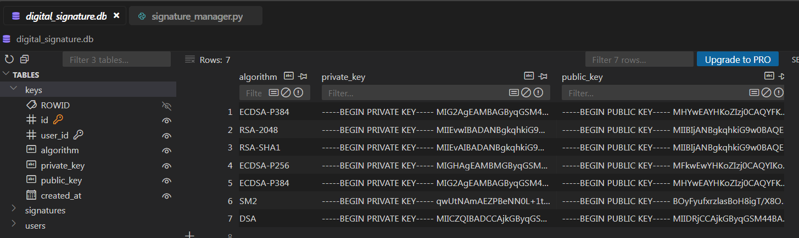
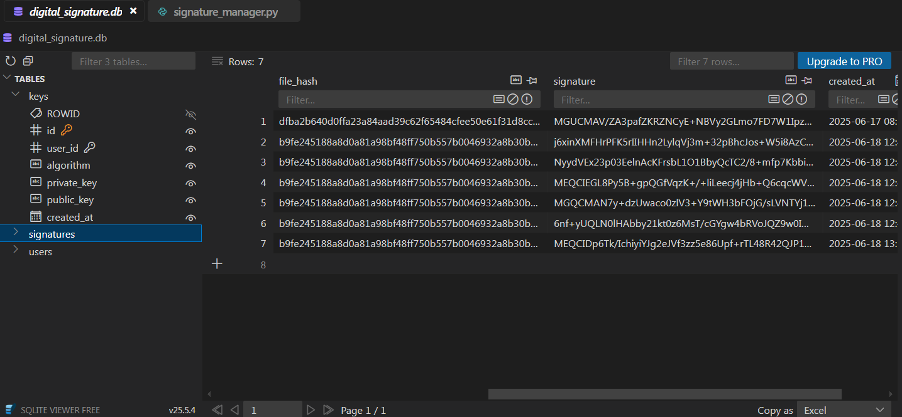
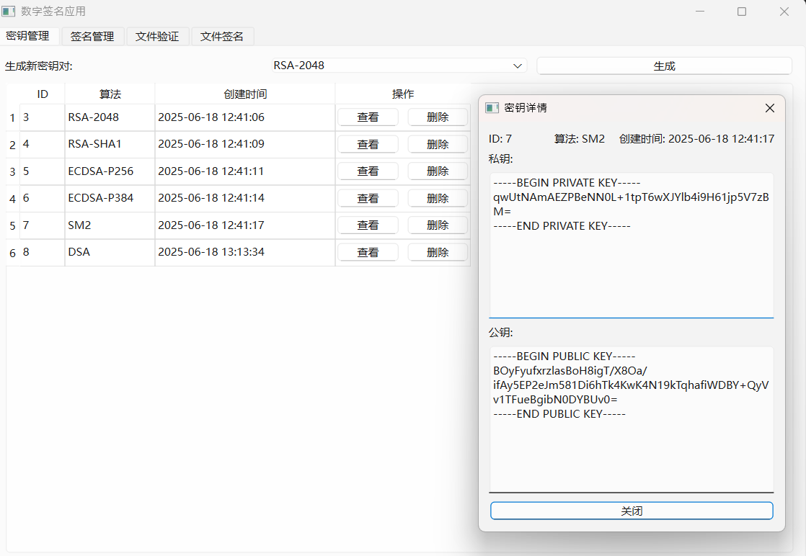
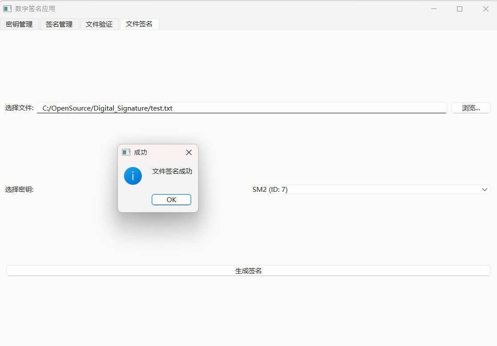
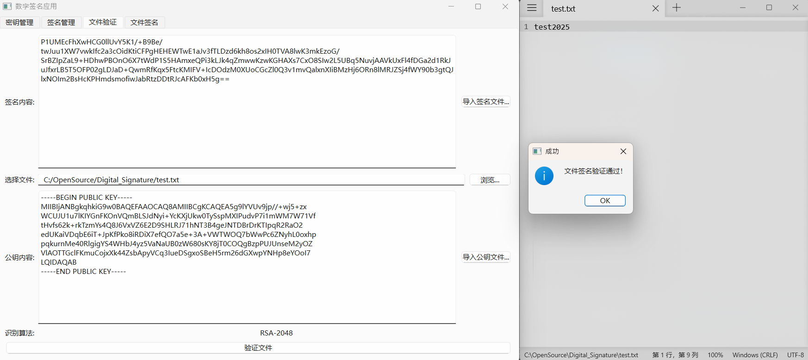
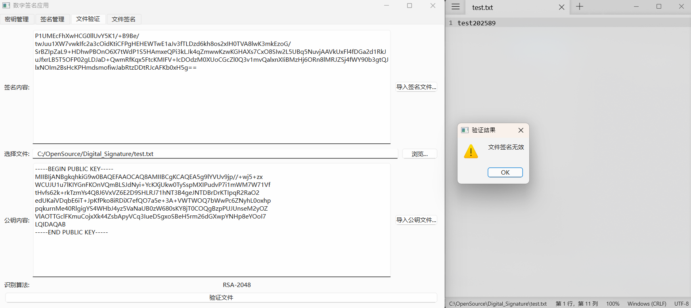

# 数字签名技术方案实践 (Duplicated)

## **一、引言**

随着多种数字签名算法（RSA、DSA、ECDSA、SM2）在各类安全系统中的广泛应用，亟需建立统一的性能评估框架。本方案旨在提供标准化的测试方法，客观比较算法性能和安全特性。

- #### 测试目标

  - 量化签名生成/验证时间
  - 评估不同密钥长度的性能差异
  - 建立安全性强度映射模型
  - 提供跨平台性能基准

### 二、系统架构【alpha】

alpha系统是一个跨端跨用户的文件签名系统，数据库会为不同的用户提供不重复的密钥。

数据库系统中根据不同的用户分别记录用户拥有的公钥和私钥，基于实验方便性会一并储存私钥。但在实际的签名系统中私钥是不会被保存的

数据库系统中根据不同的用户分别记录用户拥有签署过的文件记录，保存文件哈希值和签名信息

用户登录后进入系统，用户可以根据不同算法和使用场景生成不同的密钥。每个用户每个算法只能生成一对密钥。

用户可以选择文件并使用已经生成的密钥对进行签名。系统会在数据库自动保存对应数据。

1. A 用户利用自己的私钥签名一份文件，发送给 B
2. B 利用 A 用户的公钥对文件进行签名验证

    情况1： 内容没有被篡改：验证通过

    情况2： 内容在传输过程中遭到篡改：验证失败

